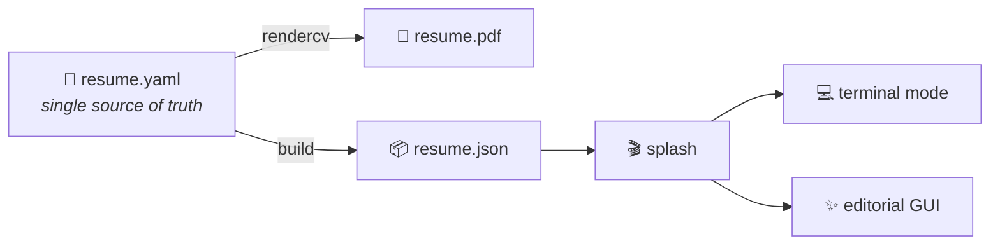

# Yashi Mishra — Portfolio

### My interactive resume + portfolio. One `resume.yaml`, always in sync.

This is the source for my personal portfolio at **[mishrayashi.github.io](https://mishrayashi.github.io)** — an interactive, multi-mode site driven by a single `resume.yaml` that also generates my PDF résumé. Pick a **retro terminal** view or a **polished editorial GUI**; both render from the same data, so they never drift.

**Live:** [mishrayashi.github.io](https://mishrayashi.github.io)

[](https://github.com/mishrayashi/mishrayashi.github.io/commits/main)
[](./LICENSE)

---

## 👩‍💻 About

I'm **Yashi Mishra**, an **AI & Data Engineer** — large-scale data engineering, production LLM systems, and real-time Voice AI. This site is the best way to see my work; the terminal mode even has a few hidden surprises.

## ✨ What's inside

- 📄 **Single source of truth** — `resume.yaml` drives both a downloadable PDF résumé (via RenderCV) and this website
- 🎭 **Two view modes** — a retro terminal (CRT, commands, themes, hidden games) and an editorial GUI (scroll-pinned animations, PWA install)
- 🎨 **Themeable** — ships with **Aurora Teal** as the default; press `T` in the site to cycle through 9 color themes
- 📱 **Fully responsive** + installable as a PWA
- 🔍 **Searchable** content, custom fields, and dynamic sections

## 🔧 How it works



`rendercv` produces the PDF; the same data flows into `resume.json`, which both view modes read — so the site and the PDF stay in sync.

## 🚀 Run it locally

```bash
npm install
npm run dev        # http://localhost:5173
```

Other useful scripts:

```bash
npm run build      # full production build
npm run preview    # serve the production build
npm run type-check # TypeScript check
```

## 🛠️ Tech stack

React 18 · TypeScript · Vite 5 · Tailwind CSS · Radix UI · Framer Motion · Wouter · RenderCV (Python) · GitHub Pages

## 🎯 Terminal commands

Type these in the terminal view:

| Command | Description |
|---------|-------------|
| `help` | Show all commands |
| `about` | Intro and quick links |
| `skills` | Technical skills |
| `experience` | Work experience |
| `education` | Education |
| `projects` | Professional projects |
| `timeline` | Chronological timeline |
| `contact` | Contact + social links |
| `resume` | Download résumé PDF |
| `theme [name]` | Change color theme |
| `neofetch` | Profile banner |
| `search [query]` | Search all content |
| `whoami` | Name and title |
| `clear` | Clear the screen |

## 📄 License

[MIT](./LICENSE) © Yashi Mishra. Built on an open-source terminal-portfolio engine; résumé rendering by [RenderCV](https://rendercv.com/).
